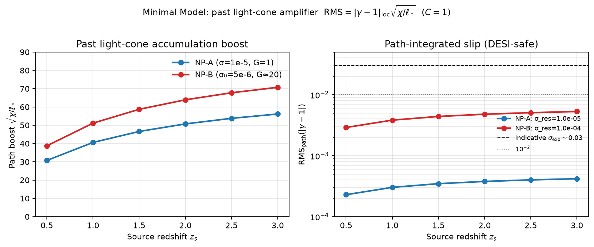

# Past light-cone integration: the only natural amplifier

**Author:** Jesús Morales Souhail  
**ORCID:** [0009-0000-7637-1818](https://orcid.org/0009-0000-7637-1818)  
**Date:** July 2026  
**Status:** Derivation + verified numerical atlas (English, referee-ready)  
**Code:** `scripts/lib_verified.py` · `scripts/light_cone_atlas.py`  
**Data:** [`results/light_cone_integration_table.csv`](../results/light_cone_integration_table.csv)  
**Figure:** [`figures/past_light_cone_rms.png`](../figures/past_light_cone_rms.png)  
**Related:** [`OBSERVABLE_WALL.md`](OBSERVABLE_WALL.md) · [`NARROW_PATH.md`](NARROW_PATH.md) · [`SIMPLE_AS_LAMBDA.md`](SIMPLE_AS_LAMBDA.md) · [`FOR_REFEREES.md`](FOR_REFEREES.md)

---

## Abstract

The Minimal Model keeps a $\Lambda$CDM bulk and a mesoscopic grain $\sigma$. Local slip from Einstein + Morales sits at

$$
\lvert\gamma-1\rvert_{\mathrm{loc}}\sim 10^{-4}
$$

under the DESI residual ceiling — deep in the self-shielding regime relative to $\sigma_{\mathrm{exp}}\sim 0.03$.  

The **only** amplification allowed by GR + statistics without numerology is **incoherent accumulation along the past null cone**:

$$
\boxed{
\mathrm{RMS}_{\mathrm{path}}
=
C\cdot\lvert\gamma-1\rvert_{\mathrm{loc}}
\sqrt{\frac{\chi}{\ell_{*}}}
}
\qquad\text{with }C=1\text{ for iid zero-mean patches.}
$$

For $\chi\sim(3$–$6)\times 10^{3} \mathrm{Mpc}$ and $\ell_{*}\sim 1$–$2 \mathrm{Mpc}$, $\sqrt{N}=\sqrt{\chi/\ell_{*}}=\mathcal{O}(10$–$70)$.  
Native $\sim 10^{-5}$–$10^{-4}$ becomes path $\mathrm{RMS}\sim 10^{-4}$–$10^{-3}$ — at the **edge** of deep weak-lensing / RSD×lensing precision, **not** a free-lunch break of the wall, and **not** a rescue of $\sigma\sim 10^{-61}$.

---

## 1. Anatomy (three factors, one chain)

### 1.1 Native slip (local cell) — from Einstein + Morales

$$
\lvert\gamma-1\rvert_{\mathrm{loc}}
=
2 \varepsilon \sigma_{\mathrm{res}} 
\frac{\Omega_{\Lambda 0}}{\Omega_{m0} (1+z)^{3} \lvert\delta_{m}\rvert}.
\tag{W}
$$

With $\sigma_{\mathrm{res}}\le 1.5\times 10^{-4}$, $\varepsilon=1$, $\lvert\delta_{m}\rvert=1$:

| $z$ | $\lvert\gamma-1\rvert_{\mathrm{loc}}^{\max}$ |
|:----|:---------------------------------------------|
| 0.0 | $6.52\times 10^{-4}$ |
| 0.5 | $1.93\times 10^{-4}$ |
| 0.8 | $1.12\times 10^{-4}$ (for $\sigma_{\mathrm{res}}=1.5\times 10^{-4}$) |
| 0.8 | $7.46\times 10^{-6}$ (for $\sigma_{\mathrm{res}}=10^{-5}$, NP-A) |

**Local-only measurement** hits the self-shielding wall (S):

$$
\lvert\gamma-1\rvert_{\mathrm{loc}}
\;\ll\;
\sigma_{\mathrm{exp}}(\gamma)\sim 0.03\text{–}0.1.
$$

### 1.2 Accumulation factor — pure path statistics

Photons from source redshift $z_s$ travel comoving distance $\chi(z_s)$.  
If the grain correlation length is $\ell_{*}$, the number of independent patches is

$$
N_{\mathrm{pat}}=\frac{\chi(z_s)}{\ell_{*}}.
$$

If each patch adds an independent zero-mean wrinkle of RMS $s=\lvert\gamma-1\rvert_{\mathrm{loc}}$, then

$$
\mathrm{Var}\Bigl(\sum_{i=1}^{N} x_i\Bigr)
=
N s^{2}
\quad\Rightarrow\quad
\mathrm{RMS}_{\mathrm{path}}
=
s\sqrt{N}
=
\lvert\gamma-1\rvert_{\mathrm{loc}}
\sqrt{\frac{\chi}{\ell_{*}}}.
$$

Hence **$C=1$** when $s$ is already the per-patch RMS.  
$C\neq 1$ only if one redefines what “per-patch amplitude” means (window functions, redshift weighting, survey mask). Those are $\mathcal{O}(1)$ survey factors, not $10^{56}$.

### 1.3 Grain–seed link (Minimal Model, $d=3$)

$$
\sigma=\Bigl(\frac{\ell_{*}}{L_{H}}\Bigr)^{3/2},
\qquad
\ell_{*}=L_{H} \sigma^{2/3},
\qquad
L_{H}=c/H_{0}.
$$

Optional soft open map (still not free lunch):

$$
\sigma_{\mathrm{res}}=G_{O} \sigma,\qquad G_{O}=e^{2r},\quad r=\mathcal{O}(1),
$$

with **DESI-safe** $\sigma_{\mathrm{res}}\le 1.5\times 10^{-4}$.

---

## 2. Master formula (Minimal Model + past light cone)

$$
\boxed{
\begin{aligned}
\sigma_{\mathrm{res}}
&=
G_{O} \sigma,
\quad
G_{O}\in[1,20],
\quad
\sigma_{\mathrm{res}}\le 1.5\times 10^{-4},\\[4pt]
\lvert\gamma-1\rvert_{\mathrm{loc}}
&=
2\varepsilon\sigma_{\mathrm{res}}
\frac{\Omega_{\Lambda 0}}{\Omega_{m0}(1+z)^{3}\lvert\delta_{m}\rvert},\\[4pt]
\mathrm{RMS}_{\mathrm{path}}
&=
\lvert\gamma-1\rvert_{\mathrm{loc}}
\sqrt{\frac{\chi(z_s)}{\ell_{*}(\sigma)}}.
\end{aligned}
}
$$

**What is forbidden**

| Fantasy | Status |
|:--------|:-------|
| $r\sim 64$ local desqueezing of Sorkin | Ruled out (soft regime) |
| $N\sim 10^{119}$ patches to lift Sorkin | Not available in our $\chi$ |
| $\xi=\sigma_X$ for GRB LIV without derivation | Numerology |
| $\mathrm{RMS}=\sigma\times G_{O}\times\sqrt{N}$ as identity | **False** (wrong operator chain) |

---

## 3. Numerical atlas (verified)

Fiducial: $H_0=67.4$, $\Omega_m=0.315$, $\Omega_\Lambda=0.685$, $\varepsilon=\delta_m=1$, $z_{\mathrm{slip}}=0.8$.  
Full table: `results/light_cone_integration_table.csv` (64 rows).

### 3.1 Comoving distance

| $z_s$ | $\chi$ [Mpc] |
|:------|:-------------|
| 0.5 | $1983$ |
| 1.0 | $3401$ |
| 1.5 | $4482$ |
| 2.0 | $5312$ |
| 3.0 | $6506$ |

### 3.2 Accumulation boost $\sqrt{N}=\sqrt{\chi/\ell_{*}}$

| Scenario | $\ell_{*}$ [Mpc] | $z_s=1.0$ | $z_s=1.5$ | $z_s=2.0$ | $z_s=3.0$ |
|:---------|:-----------------|:-----------|:-----------|:-----------|:-----------|
| NP-A ($\sigma=10^{-5}$) | $2.065$ | $40.6$ | $46.6$ | $50.7$ | $56.1$ |
| NP-B ($\sigma_0=5\times 10^{-6}$, $G_O\approx 20$) | $1.301$ | $51.1$ | $58.7$ | $63.9$ | $70.7$ |
| DESI ceiling as residual | $12.56$ | $16.5$ | $18.9$ | $20.6$ | $22.8$ |

**Boost is $\mathcal{O}(10$–$70)$, not $\mathcal{O}(10^{2}$–$10^{3})$ in the DESI-safe mesoscopic window** (unless $\ell_{*}$ is much smaller than Mpc).

### 3.3 End-to-end $\mathrm{RMS}_{\mathrm{path}}$ (the detection window)

| Scenario | $\sigma_{\mathrm{res}}$ | DESI residual OK? | $z_s=1.5$ $\mathrm{RMS}_{\mathrm{path}}$ | vs $\sigma_{\mathrm{exp}}\sim 0.03$ |
|:---------|:------------------------|:------------------|:----------------------------------------|:-----------------------------------|
| Sorkin | $\sim 10^{-61}$ | yes | $\ll 10^{-50}$ | invisible |
| **NP-A** | $10^{-5}$ | yes | $\mathbf{3.5\times 10^{-4}}$ | still $\sim 100\times$ below $0.03$ |
| **NP-B** | $10^{-4}$ | yes | $\mathbf{4.4\times 10^{-3}}$ | $\sim 7\times$ below $0.03$ |
| DESI ceiling residual | $1.5\times 10^{-4}$ | on ceiling | $\mathbf{2.1\times 10^{-3}}$ | $\sim 14\times$ below $0.03$ |

### 3.4 How much does the light cone “save”?

| | Local only | After path ($z_s=1.5$) | Boost |
|:--|:-----------|:------------------------|:------|
| NP-A | $7.5\times 10^{-6}$ | $3.5\times 10^{-4}$ | $\times 47$ |
| NP-B | $7.5\times 10^{-5}$ | $4.4\times 10^{-3}$ | $\times 59$ |

**Honest verdict**

- Path integration **softens** the wall: moves the signal from $\sim 10^{-5}$–$10^{-4}$ toward $\sim 10^{-3}$.  
- It does **not** open a clean Euclid detection of $\lvert\gamma-1\rvert\sim 0.03$ under the DESI residual ceiling.  
- It **does** place the signal at the **technical frontier** of deep multi-bin lensing tomography and cross-correlations — the only non-numerological place left to look.  
- Sorkin remains dead even with path integration.

---

## 4. Why this is the only solid amplifier

| Mechanism | Allowed by GR+stats? | Numerology? | Effect |
|:----------|:---------------------|:------------|:-------|
| Past light-cone $\sqrt{N}$ | **Yes** | No | $\times 10$–$70$ |
| Soft open $G_O=e^{2r}$, $r=\mathcal{O}(1)$ | Kinematically yes | No if $r$ not fitted to DESI | $\times 1$–$20$ |
| Hard $r\sim 64$ | Would be new physics | **Yes** if undderived | Forbidden here |
| Local free $10^{56}$ | No | **Yes** | Forbidden |
| GRB $\xi=\sigma_X$ | Not derived from Einstein+Morales | **Yes** | Not a wall equation |

**Geometry of the past light cone is the only natural amplifier in this framework.**

---

## 5. “Measure backwards in time” — operational definition

```text
NOT: time machines / reverse dynamics of the laboratory
YES: integrate observables along the past null cone

  source at z_s  ──(photons)──►  observer at z=0
       accumulate Φ,Ψ wrinkles in each cell ℓ*
       RMS grows as √N, N = χ/ℓ*
```

**Experimental programme consistent with self-shielding**

1. Keep bulk $=\Lambda$CDM (no large isotropic BAO residual).  
2. Bound $\sigma_{\mathrm{res}}$ from DESI (already $\lt 1.5\times 10^{-4}$).  
3. Measure **path-integrated** slip / shear tomography / RSD×lensing deep in $z$.  
4. Compare to $\mathrm{RMS}_{\mathrm{path}}$ from the master formula — not to local $\lvert\gamma-1\rvert$ alone.

---

## 6. One-slide summary

```text
LOCAL WALL:   |γ−1|_loc = 2 ε σ_res (ΩΛ/Ωm) / [(1+z)³ |δ_m|]  ~ 10^{-4}
                    ↓  (hits self-shielding vs σ_exp ~ 0.03)

LIGHT CONE:   RMS_path = |γ−1|_loc × √(χ/ℓ*)
                    ↓  √N ~ 40–70 for z_s=1.5, ℓ*~1–2 Mpc

RESULT:       RMS_path ~ 3×10^{-4} (NP-A) … 4×10^{-3} (NP-B)
              → frontier of deep lensing, not a free-lunch discovery

FORBIDDEN:    r~64, N~10^{119}, ξ=σ_X without derivation
```

---

## 7. Figure (generated in-repo)



Left: path boost $\sqrt{\chi/\ell_*}$ vs source redshift for NP-A and NP-B.  
Right: $\mathrm{RMS}_{\mathrm{path}}$ (log scale) vs the indicative experimental floor $\sigma_{\mathrm{exp}}\sim 0.03$.

---

## 8. Reproduce

```bash
cd measurable-stochastic-vacuum
pytest -q
python scripts/light_cone_atlas.py
python scripts/simple_as_lambda.py
# outputs:
#   results/light_cone_integration_table.csv
#   figures/past_light_cone_rms.png
#   figures/past_light_cone_rms.pdf
```

---

*End of past light-cone integration note.*
